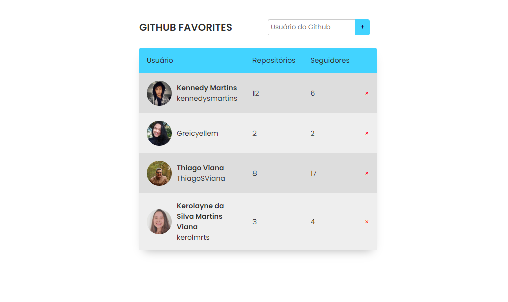

# Desafio GitFav

> Trilha Explorer

O Stage 6 da trilha Explorer da Rocketseat foi concluído com êxito, marcando o término do último desafio. O projeto desenvolvido, denominado GitFav, permite aos usuários favoritar e remover usuários do Github de uma lista. Para alcançar esse objetivo, a API do Github foi utilizada para recuperar informações dos usuários. Durante esse desafio, foram explorados os seguintes conceitos e tópicos:

- Realização de requisições à API do Github.
- Aprendizado sobre a criação de uma classe exclusiva para leitores de tela (Screen reader only).
- Aplicação de princípios de programação orientada a objetos (POO).
- Utilização de classes e heranças para estruturar o código.
- Geração de elementos HTML dinamicamente através do JavaScript.
- Compreensão da importância da imutabilidade no desenvolvimento.
- Introdução ao uso do armazenamento local (localStorage).
- Exploração de métodos estáticos e promises.
- Implementação de manipulação assíncrona com Async Await e promises.
- Gerenciamento do fluxo da aplicação com Try, Catch e Throw.
- Criação de tabelas dentro de documentos HTML.

[🔗 Clique aqui para acessar](https://kennedysmartins.github.io/Github-Favorites-App/)

## 🛠️ Tecnologias

- HTML
- CSS
- JavaScript
